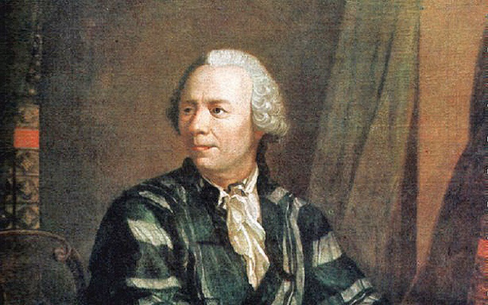

# Project Euler
 

 

My solutions to the problems of the Project Euler

## Problems

| № | Title | Solution |
| :---: | :---: | :---: |
| 1 | Multiples of 3 and 5 | 233168 |
| 2 | Even Fibonacci numbers | 4613732 |
| 3 | Largest prime factor | 6857 |
| 4 | Largest palindrome product | 906609 |
| 5 | Smallest multiple | 232792560 |
| 6 | Sum square difference | 25164150 |
| 7 | 10001st prime | 104743 |
| 8 | Largest product in a series | 23514624000 |
| 9 | Special Pythagorean triplet | 31875000 |
| 10 | Summation of primes | 142913828922 |
| 11 | Largest product in a grid | 70600674 |
| 12 | Highly divisible triangular number | 76576500 |
| 13 | Large sum | 5537376230 |
| 14 | Longest Collatz sequence | 837799 |
| 15 | Lattice paths | 137846528820 |
| 16 | Power digit sum | 1366 |
| 17 | Number letter counts | 21124 |
| 18 | Maximum path sum I | 1074 |
| 19 | Counting Sundays | 171 |
| 20 | Factorial digit sum | 648 |
| 21 | Amicable numbers | 31626 |
| 22 | Names scores | 871198282 |
| 23 | Non-abundant sums | 4179871 |
| 24 | Lexicographic permutations | 2783915460 |
| 25 | 1000-digit Fibonacci number | 4782 |
| 26 | Reciprocal cycles | 983 |
| 27 | Quadratic primes | -59231 |
| 28 | Number spiral diagonals | 669171001 |
| 29 | Distinct powers | 9183 |
| 30 | Digit fifth powers | 443839 |
| 31 | Coin sums | 73682 |
| 32 | Pandigital products | 45228 |
| 33 | Digit cancelling fractions | 100 |
| 34 | Digit factorials | 40730 |
| 35 | Circular primes | 55 |
